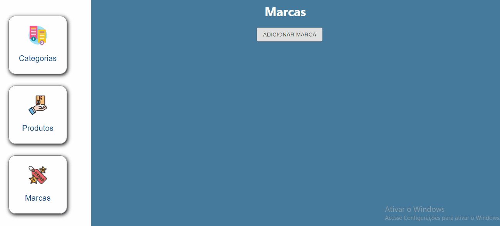
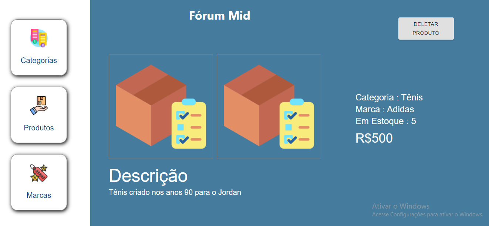

<h1>Dashboard de admin</h1>

 

✅ - Adicionar produtos  
✅ - Adicionar categorias  
✅ - Adicionar marcas

 

Um dashboard para adiministradores que permite adicionar 

e excluir produtos, categorias e marcas e também tem umas tela

de produtos dinâmicos

 

 

 

🚀 Tecnologias

- Uuid
- HTML
- CSS
- React
- NodeJS
- Express
- Material UI
